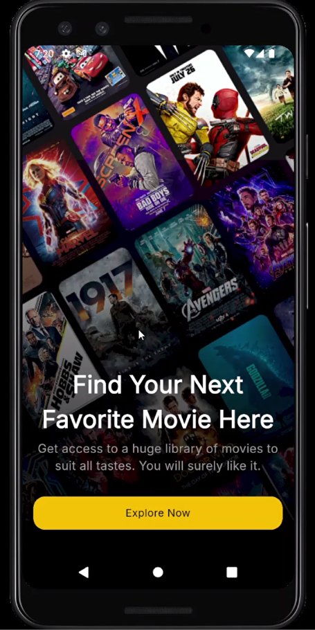
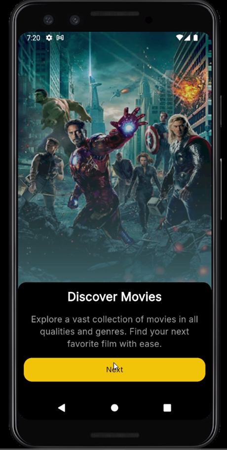
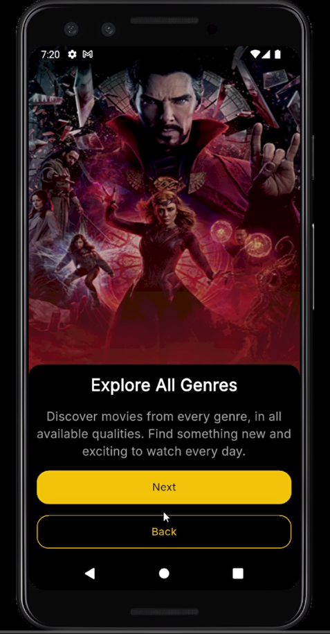
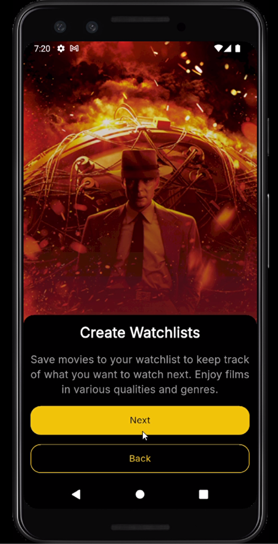
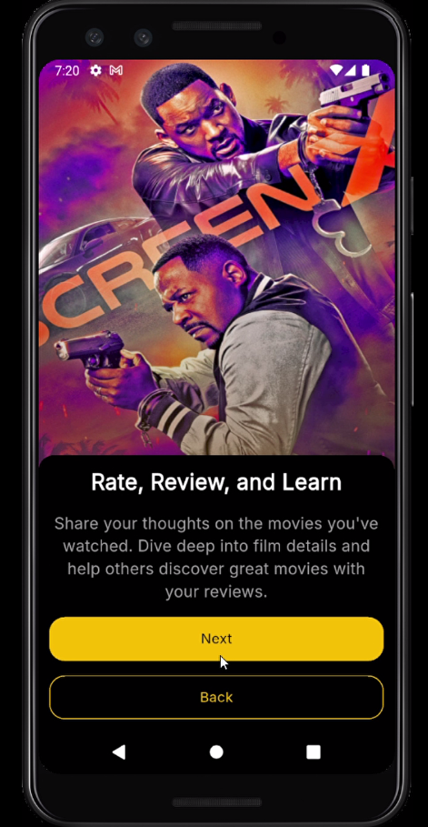
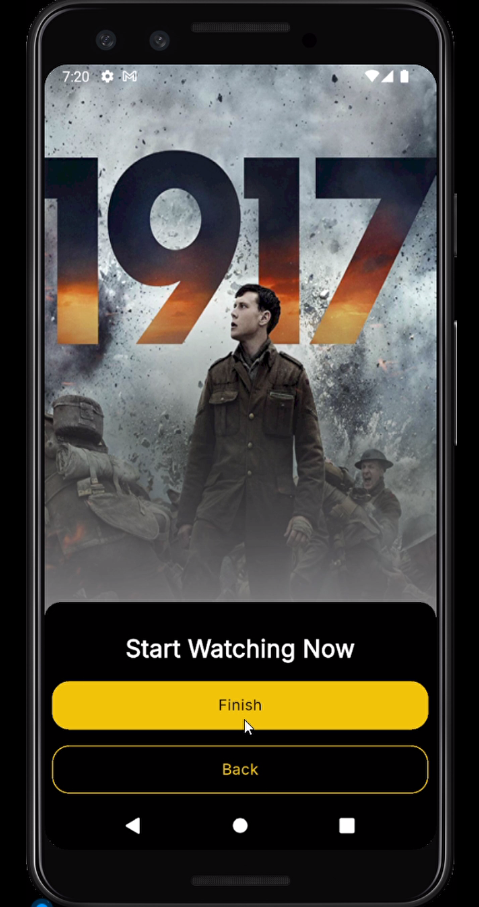
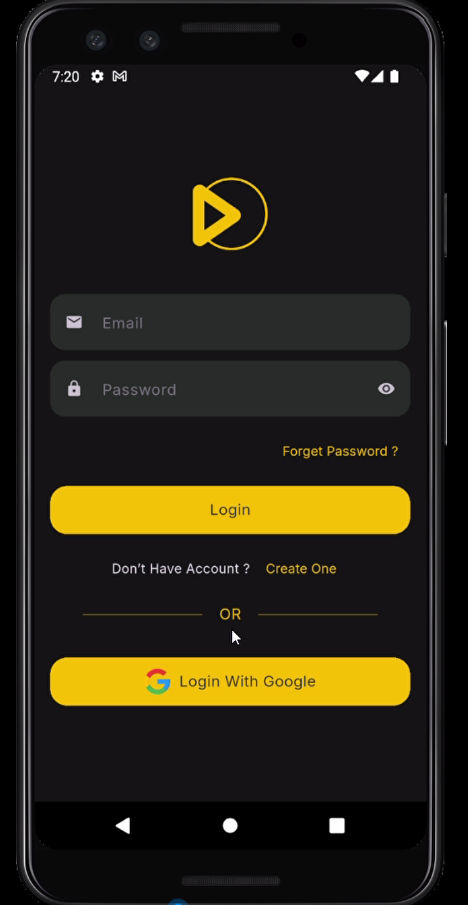
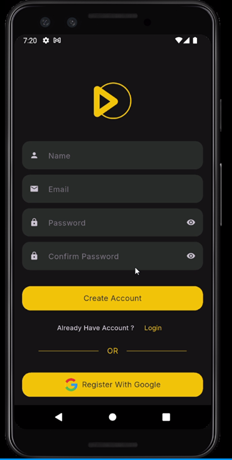
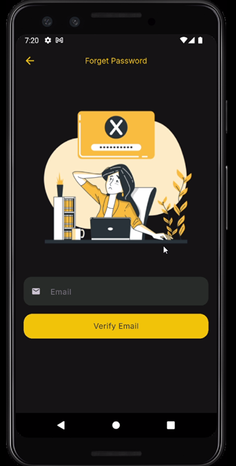

# 🎬 CineZone App

A Flutter app for discovering movies, managing watchlists, and more designed with an engaging UI and connected to Firebase for authentication.

## 🚀 Features

- 🖼 Onboarding Screens with smooth navigation and background gradients.
- 🔐 Firebase Authentication:
  - Login
  - Register
  - Forgot Password

## 📦 Tech Stack

- Flutter
- Firebase Auth
- GoRouter
- ScreenUtil
- MVVM 

## 🛠 Still in Progress...

Coming soon:
- Home Screen UI
- Movie Lists & Details
- Search & Filters

---
## 📱 Screenshots

### Onboarding Screens

  
  
   

  
    
   

### Auth Screens

  
  
  

